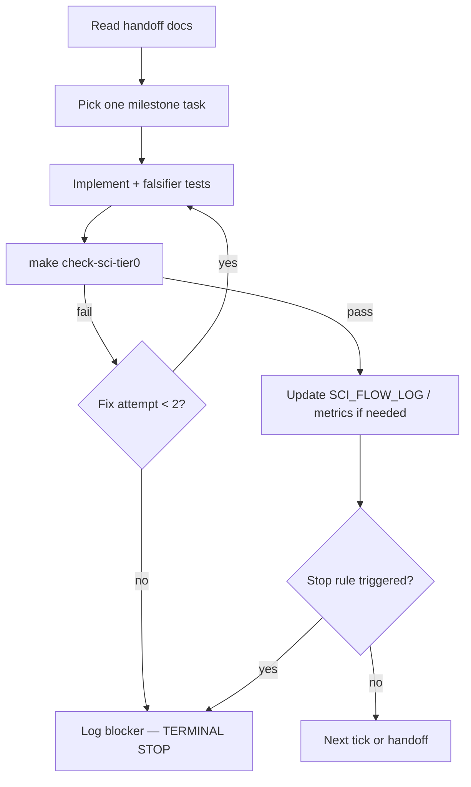

# Sci-Loop — EIA autonomous research cadence

Run recurring sci-flow iterations without unbounded autonomy. Each tick is one bounded cycle; stop rules from **eia-sci-flow** always apply.

## Prerequisites

1. Load **eia-sci-flow** (`.cursor/skills/eia-sci-flow/SKILL.md`) — branch, read order, claim ceiling, stop rules.
2. On branch `research/cursor-starter-v0.2-woe-eis`.
3. Optional: read **loop-library** at `C:\Users\lawye\.agents\skills\loop-library\SKILL.md` to audit loop design.

## Invoke (Cursor)

```
/loop 30m Follow sci-loop: read NEXT_SCI_AGENT_PROMPT, execute one sci-flow tick per eia-sci-flow skill, run make check-sci-tier0, update SCI_FLOW_LOG if changed.
```

Dynamic cadence (agent picks delay):

```
/loop Follow sci-loop tick per eia-sci-flow; verify with make check-sci-tier0; stop on sci-flow stop rules.
```

Mechanism: Cursor **loop** skill (`C:\Users\lawye\.cursor\skills-cursor\loop\SKILL.md`) — subscription timer (cloud) or monitored shell (local IDE).

## One tick workflow



### Per-tick checklist

1. **Trigger:** timer tick or explicit `/loop` wake.
2. **Scope:** one implementation-plan item (prefer Phase 0–2 science-critical path).
3. **Verify:** `make check-sci-tier0` must pass before claiming progress.
4. **Log:** append to `docs/SCI_FLOW_LOG.md` when topology or milestone status changes.
5. **Terminal stop:** any eia-sci-flow stop rule; tier-0 failure after 2 fix attempts; user interrupt.

## Guardrails (from loop-library)

- No silent widening of capability, consent, or claim level.
- No LLM calls for ATT evidence at Tier 0.
- Do not lower governor thresholds to pass science checks.
- Each tick must have a verifiable outcome (passing check or documented blocker).

## Loop Doctor

If the loop runs too long, skips verification, or overclaims: audit with **loop-library** references/audit.md workflow. Repair by re-anchoring to tier-0 check and C2 ceiling.
