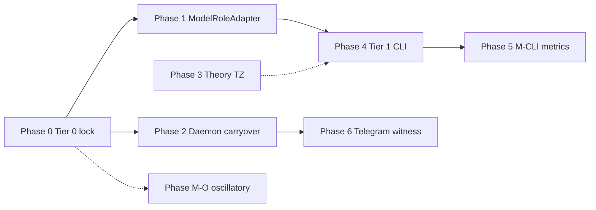

# Endogeneity Implementation Plan — M-CLI Roadmap

**Status:** `OPERATIONAL` (2026-08-21)  
**Branch:** `research/cursor-starter-v0.2-woe-eis`  
**Claim ceiling:** **C2** scoped (\(E_{\mathrm{endo}}\) / ATT-E partial). **No AGI\* claim.**

---

## Краткое резюме (RU)

Этот план описывает **как реализовать stable runtime endogeneity** в EIA sci-flow — не как «agentic LLM», а как **динамическую multi-loop архитектуру** с причинным баром \(do(Z)\) при \(X^{\mathrm{trigger}}=0\). LLM/CLI — сменные исполнители в implementation annex; источник \(E_{\mathrm{endo}}\) — persistent internal state + harness. Минимальный path (Tier 0) не требует моделей; полный path добавляет CLI genesis и Telegram witness **последним**.

---

## 1. Purpose and scope

### 1.1 What this plan covers

| In scope | Out of scope |
|----------|--------------|
| Tier 0–3 implementation roadmap | AGI\* / \(\tau_{AGI}\) claims |
| M-CLI model-role architecture | Merging WoE runtime into `main/src/eia/` |
| Daemon carryover (shadow-first) | Lowering governor thresholds for science |
| Consolidated theory TZ (Phase 3) | Kuramoto-as-\(E_{\mathrm{endo}}\) |
| ATT evidence harness wiring | Chat self-ascription as \(E_{\mathrm{endo}}\) evidence |

### 1.2 Theory vs implementation annex

| **Theory (invariants)** | **Implementation annex (replaceable)** |
|-------------------------|----------------------------------------|
| State \(S_t = (z_t, W_t, M_t, d_t, G_t)\) | Concrete world model (sim / symbolic / LLM) |
| Multi-loop topology \(W \to M \to d \to G \to \Pi \to A\) | `CognitiveLoop`, WoE v0.2, daemon tick |
| Order parameters: \(E_{\mathrm{endo}}\) primary, \(N_H\) secondary | CF-4, EOI, ATT runners, CSV metrics |
| Causal bar \(do(Z)\), falsifier registry | Named resets, twin ops, shadow multitick |
| Stability vector \(\mathfrak{E}\), metastability | Drive hyperparameters, governor config |
| ATT pre-registration | Seed counts, JSON result files |

**Canonical theory docs:** [`STABLE_ENDOGENEITY.md`](../research/sci_flow/STABLE_ENDOGENEITY.md) · [`CAUSAL_ENDOGENEITY.md`](../research/sci_flow/CAUSAL_ENDOGENEITY.md) · [`AGI_PHASE_TRANSITION.md`](../research/sci_flow/AGI_PHASE_TRANSITION.md)

---

## 2. Current state (baseline)

**Branch HEAD:** `5171780`+ (M-SE chain through stable recurrence cross-links)

| Milestone | Status | Key artifact |
|-----------|--------|--------------|
| M-C | DONE | CF-1 prompt deletion (C1 on full window) |
| M-E / ATT-G | Explore | `goal_genesis.py` — catalog/wording falsifiers 0.0 |
| M-P / ATT-P | Explore | Endogenous store 1.0; re-prompt 0.0 |
| M-R / ATT-R | Explore | Closed-loop sim 1.0; falsifiers 0.0 |
| M-R-LIVE | DONE | `run_shadow_att_r.py` — closed_loop 1.0 on main loop |
| M-N / ATT-N | Explore | Budget \(B\) pre-registered; opacity falsifiers 0.0 |
| M-D2 / ATT-D | Explore | Cross-domain woe_catalog + twin_ops 0.95 |
| M-SE | DONE | `STABLE_ENDOGENEITY.md` + `endogeneity_stack_sim.py` ablation |
| M-CLI | **DONE** | `model_roles.py`, `make check-sci-tier0` |
| M-O | **IN PROGRESS** | [OSCILLATORY_ENDOGENEITY.md](../research/sci_flow/OSCILLATORY_ENDOGENEITY.md) — optional \(O_t\) substrate |

**Toy ablation summary (10 seeds):** raw prediction-error → ~99% noisy-TV trap; learning-progress / stable_stack → ~7.5 mastered goals, trap ~0.9–1.7%, bounded drives.

---

## 3. Prerequisites — install and configure

### 3.1 Required (Tier 0 — no LLM)

```powershell
# Python 3.12+
cd C:\Users\Public\PROACTIVE_AI
git checkout research/cursor-starter-v0.2-woe-eis
git pull origin research/cursor-starter-v0.2-woe-eis

pip install -e ".[dev,live]"
pip install numpy matplotlib   # endogeneity_stack_sim.py (not in pyproject core deps)

# Research tree tests
cd research\cursor-starter-v0.2
pytest tests/test_agi_transition.py tests/test_live_att_r.py
cd ..\..
pytest tests/test_shadow_multitick.py
```

### 3.2 Optional (later phases)

| Component | Phase | Purpose | Setup |
|-----------|-------|---------|-------|
| **Telegram bot** | 6 | Occam witness (not proof) | BotFather → `.env`: `TELEGRAM_BOT_TOKEN`, `TELEGRAM_CHAT_ID` |
| **NAMM** | 4+ | ATT-N soft witness | Clone `C:\Users\Public\NAMM`, `pip install -e .`, `namm sci-flow run` |
| **Cursor CLI / local LLM** | 4 | Tier 1 goal genesis | API keys; `model_roles.enabled: true` |
| **JAX / DreamerV3 / pymdp** | Future | World-model substrate | Not required for M-CLI |

### 3.3 Environment and branches

```powershell
# .env — NEVER commit
TELEGRAM_BOT_TOKEN=...
TELEGRAM_CHAT_ID=...

# Smoke-only override — NOT science evidence:
# EIA_MIN_CONTACT_SCORE=-1.0
# EIA_MIN_EVSI=0.0
```

| Repo | Branch | Path |
|------|--------|------|
| EIA | `research/cursor-starter-v0.2-woe-eis` | `C:\Users\Public\PROACTIVE_AI` |
| NAMM | `hypothesis/cognitive-antigravity` | `C:\Users\Public\NAMM` |

**Hard stop:** Do not merge WoE research runtime into `main/src/eia/`.

---

## 4. Architecture summary

### 4.1 Multi-loop stack

```
W_t → M_t → d_t → G_t → Π_t → A_t → Memory/Update → W_{t+1} → G_{t+1}
```

Four coupled loops: **epistemic** · **autotelic** · **homeostatic** · **metacognitive**

### 4.2 Model tier strategy

| Tier | LLM? | Role | ATT evidence? |
|------|------|------|---------------|
| **0** | No | Sim + CF-4 + ATT stubs | **Yes** (baseline) |
| **1** | Cheap CLI | Goal candidates when \(B_t=1\) | Explore only |
| **2** | Stronger CLI | Offline counterfactual rollouts | Explore only |
| **3** | Gated CLI | Live action phrasing | Witness only; governor intact |

### 4.3 Planned `model_roles` config (Phase 1)

Add to [`research/sci_flow/config.yaml`](../research/sci_flow/config.yaml):

```yaml
model_roles:
  enabled: false
  tier: 0
  world_imagination:
    provider: null
    offline_only: true
    max_calls_per_episode: 0
  goal_genesis:
    provider: null
    trigger: drive_birth          # NOT every_tick
    min_epistemic_pressure: 0.35
    fallback: code                # compose_from_world_state
  action_planner:
    gated_by: [governor, authentic_reason]
    shadow_only: true
  att_evidence:
    llm_allowed: false            # hard ban for ATT scoring
    auditor: python_only
```

---

## 5. Development phases

### Phase 0 — Tier 0 regression lock

**Goal:** Freeze ATT baseline without any LLM calls.

| Item | Detail |
|------|--------|
| **Deliverables** | Regression script or CI job; pinned result JSON hashes |
| **Files** | `endogeneity_stack_sim.py`, `run_shadow_att_r.py`, `run_cf4.py`, `run_live_att_r.py` |
| **Commands** | See §7 Verification checklist |
| **ATT linkage** | ATT-E (CF-4), ATT-R (shadow), M-SE ablation |
| **Done when** | All runners pass; rates match pre-registered baselines |
| **User** | Run `pip install` once |
| **Agent** | Wire CI / `make check-sci` target |

---

### Phase 1 — M-CLI `ModelRoleAdapter` stub + config

**Goal:** Interface for replaceable model roles; default = pure Python.

| Item | Detail |
|------|--------|
| **Deliverables** | `research/cursor-starter-v0.2/src/eia/model_roles.py`; `model_roles` in config.yaml; unit tests |
| **Interface** | `propose_goal_candidates(state) -> list[GoalCandidate]`; default delegates to `compose_from_world_state` |
| **ATT linkage** | None (scaffold only); `att_evidence.llm_allowed: false` enforced |
| **Done when** | Tests pass with `tier: 0`; no behavior change vs current genesis |
| **User** | — |
| **Agent** | Implement stub + config + tests |

---

### Phase 2 — Daemon carryover (shadow-first)

**Goal:** Cross-tick persistence of \(W_t, d_t\) so \(W' \to G'\) closes ATT-R gap vs production daemon.

| Item | Detail |
|------|--------|
| **Deliverables** | `StateStore` or equivalent; shadow daemon path reuses single `CognitiveLoop` |
| **Files** | `src/eia/runtime/daemon.py`, `shadow_multitick.py`, optional `state_store.py` |
| **Gap today** | Production daemon creates fresh `CognitiveLoop` every tick |
| **ATT linkage** | ATT-R live path; M-R-LIVE metrics update |
| **Done when** | Multi-tick shadow shows \(G_{t+1}\) from carryover without re-prompt; falsifiers still 0.0 |
| **User** | — |
| **Agent** | Implement carryover; extend `run_live_att_r.py` |

---


### Phase M-O (parallel track) — Oscillatory substrate harness

**Goal:** Explore optional \(O_t\) oscillatory field as **one implementation annex among many**, feeding \(\Phi_t\) and birth gate \(B_t\) — **not** primary \(E_{\mathrm{endo}}\) claim path.

| Item | Detail |
|------|--------|
| **Status** | Planned (adjunct to ATT-E; parallel to ATT-G / M-E) |
| **Deliverables** | oscillatory_state.py stub **or** minimal extend of WoE cf5/Kuramoto path so \(O_t\) feeds drive features; pre-registered do(O) arms |
| **Falsifier tests** | F-SYNC, F-PHASE-ONLY, F-KURAMOTO-AS-E (reuse M-D ban); genesis linkage required |
| **Theory doc** | [OSCILLATORY_ENDOGENEITY.md](../research/sci_flow/OSCILLATORY_ENDOGENEITY.md) |
| **ATT linkage** | Explore only; c2_claim: false; no ATT-R from Kuramoto alone |
| **Done when** | Harness runs with falsifier arms; metrics report stub; no C-level raise |
| **User** | — |
| **Agent** | Stub + falsifier unit tests; wire minimal \(\Psi(O_t)\) into drive path |

**Explicit:** Kuramoto sync alone \(
eq\) \(E_{\mathrm{endo}}\) (M-D: coupled 0.95, K=0 0.94, scramble 0.69). Oscillation as state / \(\Phi_t\) source is **not** sufficient proof without \(do(O)\) + genesis linkage.

---

### Phase 3 — Consolidated theory TZ

**Goal:** Single reviewer-facing theory document.

| Item | Detail |
|------|--------|
| **Deliverables** | `research/sci_flow/THEORY_TZ_STABLE_ENDOGENEITY.md` |
| **Sources** | Merge skeleton from AGI_PHASE_TRANSITION + STABLE_ENDOGENEITY + CAUSAL_ENDOGENEITY |
| **Annex pointers** | AGI_TRANSITION_TEST.md, endogeneity_stack_sim.py, MULTI_TOPOLOGY_LOOPS.md |
| **Done when** | §0–§11 outline complete; explicit theory/annex split |
| **User** | Review |
| **Agent** | Author consolidated doc |

---

### Phase 4 — Tier 1 CLI genesis (explore only)

**Goal:** CLI proposes goal candidates **only** when drive birth gate \(B_t=1\).

| Item | Detail |
|------|--------|
| **Deliverables** | CLI adapter behind `ModelRoleAdapter`; JSON schema `goal_genesis_v1` |
| **Trigger** | `DriveEngine.is_actionable()` + `epistemic_pressure >= 0.35` + \(B_t=1\) |
| **Controls** | random_wording / catalog falsifiers must still fail |
| **ATT linkage** | ATT-G explore proxy; `claim_allowed: false` |
| **Done when** | M-CLI metrics compare code-only vs CLI-assisted under same CF-4 arms |
| **User** | Provide API key / Cursor CLI auth |
| **Agent** | Adapter + harness + metrics report |

---

### Phase 5 — M-CLI metrics report

**Goal:** Pre-registered comparison document.

| Item | Detail |
|------|--------|
| **Deliverables** | `research/sci_flow/M-CLI_metrics_YYYY-MM-DD.md` |
| **Compare** | Tier 0 vs Tier 1 genesis under identical falsifier arms |
| **Flags** | `agi_star_claim: false`, `c3_claim: false`, `emit_m0: false` |
| **Done when** | Report committed; SCI_FLOW_LOG Entry updated |
| **User** | — |
| **Agent** | Run + write report |

---

### Phase 6 — Live Telegram witness (last)

**Goal:** Occam witness channel — unsolicited contact possible if endogenous initiative exists.

| Item | Detail |
|------|--------|
| **Deliverables** | `eia tick --live` under AuthenticReason + governor (no threshold gutting) |
| **Prerequisite** | Phase 2 carryover + ATT-R pass on shadow path |
| **ATT linkage** | `T_LIVE_gate` in MULTI_TOPOLOGY_LOOPS.md — witness only, not proof |
| **Done when** | Trace + EOI receipt; message is observable, not claim evidence |
| **User** | Telegram tokens; explicit consent |
| **Agent** | Wire live path; document in metrics |

---

## 6. Anti-patterns (hard ban)

| Anti-pattern | Why it breaks science | Falsifier / guard |
|--------------|----------------------|-------------------|
| **Prompt-as-drive** | \(d_t\) becomes function of user text | F-EXT; CF-1 |
| **Kuramoto-as-\(E\) or ATT-R** | M-D falsified necessity | `kuramoto_is_not_att_r` |
| **Single intrinsic reward LLM loop** | Noisy-TV / extinction | F-SR; M-SE ablation |
| **Chat «I am endogenous»** | Declaration ≠ causation | F-DECL; `e_endo_label_admissible` |
| **LLM every tick for goals** | Prompt-shaped \(G\) | ATT-G random_wording |
| **Lowering governor to pass** | Smoke ≠ evidence | M-R-LIVE flags |
| **Merge WoE → main runtime** | Isolation break | NEXT_SCI_AGENT_PROMPT stop rule |
| **Telegram message as proof** | Channel ≠ causal bar | T_LIVE_gate ceiling |

---

## 7. Verification checklist

### 7.1 Toy ablation

```powershell
python endogeneity_stack_sim.py
# Expect: stable_stack mastered ~7.5, noisy_trap ~0.009; prediction_error trap ~0.99
```

### 7.2 Shadow ATT-R

```powershell
python research/sci_flow/run_shadow_att_r.py
# Expect: closed_loop att_r_evidence_rate = 1.0; falsifier arms = 0.0; emit_m0_rate = 0.0
```

### 7.3 Live ATT-R (shadow path)

```powershell
python research/sci_flow/run_live_att_r.py
# Same rate pattern; claim_allowed=false
```

### 7.4 CF-4 (ATT-E)

```powershell
python research/cursor-starter-v0.2/research/sci_flow/run_cf4.py
# Or equivalent CF-4 runner per config.yaml
```

### 7.5 Pytest

```powershell
pytest tests/test_shadow_multitick.py
cd research/cursor-starter-v0.2 && pytest tests/test_agi_transition.py tests/test_live_att_r.py
```

---

## 8. Phase dependency graph



Phases 0–2 are **science-critical**. Phases 4–6 are **optional explore / witness** layers.

---

## 9. References

| Doc | Role |
|-----|------|
| [`STABLE_ENDOGENEITY.md`](../research/sci_flow/STABLE_ENDOGENEITY.md) | M-SE operational theory |
| [`CAUSAL_ENDOGENEITY.md`](../research/sci_flow/CAUSAL_ENDOGENEITY.md) | Causal bar + falsifiers |
| [`AGI_TRANSITION_TEST.md`](../research/sci_flow/AGI_TRANSITION_TEST.md) | ATT battery |
| [`AGI_STAR_CRITERION.md`](../research/sci_flow/AGI_STAR_CRITERION.md) | Compact criterion |
| [`NEXT_SCI_AGENT_PROMPT.md`](NEXT_SCI_AGENT_PROMPT.md) | Agent handoff |
| [`config.yaml`](../research/sci_flow/config.yaml) | Milestone registry |
| [`MULTI_TOPOLOGY_LOOPS.md`](MULTI_TOPOLOGY_LOOPS.md) | Topology + witness ceilings |
| [`LIVE_STACK.md`](LIVE_STACK.md) | Telegram / daemon install |

---

## Document history

| Date | Change |
|------|--------|
| 2026-08-21 | Initial M-CLI roadmap (Phases 0–6) |
