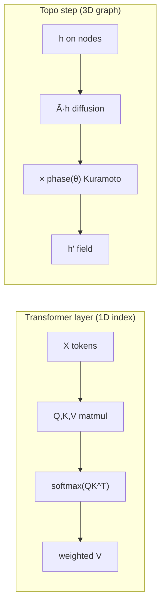

# LLM Matrix Bridge — мост между матрицами трансформера и топологическим вычислением

> RU + EN technical note. Исследовательский документ ветки `kairologos_standalone`.  
> Не заявление о превосходстве topo над LLM — **анализ узкого места представления**.

---

## 1. Как считает трансформер / How transformers compute

Для входа \(X \in \mathbb{R}^{n \times d}\) (n токенов, d модель):

\[
Q = X W_Q,\quad K = X W_K,\quad V = X W_V
\]

\[
\text{Attention}(X) = \mathrm{softmax}\!\left(\frac{Q K^\top}{\sqrt{d_k}}\right) V
\]

**Ключевое свойство:** softmax строит **попарные веса** между позициями \(i, j\) на основе скалярных произведений в пространстве ключей. Позиция задаётся:

1. **порядковым индексом** токена в последовательности;
2. **positional encoding** (sin/cos или learned).

То есть «кто с кем говорит» в базовой форме — **1D-индексная** структура: перестановка строк \(X\) меняет семантику слоя (если нет явной permutation equivariance).

Стек слоя:

```
X → [Attention] → [FFN: W2·σ(W1·X)] → … → logits
```

Каждый шаг — **линейная последовательность matmul** вдоль оси токенов.

---

## 2. Топологическая альтернатива / Topological alternative

В `topo_lang` программа — **3D-граф** с узлами \((x,y,z)\), фазами \(\theta_i\) и рёбрами с весами.

Один шаг «topo execution» (см. `lib/llm_vs_topo_matrix.py`):

\[
h^{(t+1)} = (1-\alpha)\, h^{(t)} + \alpha\, \tilde{A}\, h^{(t)} \cdot \phi(\theta)
\]

где \(\tilde{A}\) — нормализованная матрица смежности, \(\phi\) — фазовая модуляция (Kuramoto-подобная).

| Аспект | Transformer attention | Topo graph step |
|--------|----------------------|-----------------|
| Структура связей | все-пары через QK^T | локальные рёбра + глобальная фаза |
| Индекс | позиция токена 0…n-1 | координаты + топология |
| Нелинейность | softmax | фазовая синхронизация + метрика |
| Состояние | вектор на токен | поле на графе + HDC bundle |

**HDC/VSA** (`lib/hdc.py`): binding как поэлементное умножение, bundling как сумма — **ND-суперпозиция** многих пар ключ-значение в одном векторе. Это другой компромисс: не pairwise softmax, а голографическая интерференция.

---

## 3. Диаграмма: 1D matmul stack vs 3D Laplacian flow



ASCII:

```
LLM:     tok0 — tok1 — tok2 — … — tokN
              ↘ QK^T all-pairs ↙
              softmax → mix V

TOPO:    node_i —edge— node_j  (3D positions fixed)
              ↓ Laplacian flow on graph
              ↓ phase coupling θ_i
         geodesic path + braid crossings
```

---

## 4. Узкое место представления / Representation bottleneck

Мы **не** утверждаем, что трансформеры ошибочны — они масштабируются и работают.

Гипотеза исследования (открытый вопрос):

> Часть структуры «программы» и «смысла» теряется при проекции ND-топологии на 1D-ленту токенов.  
> Для дискурса AGI это может быть релевантным **bottleneck**, а не доказательством необходимости topo-AGI.

Эмпирические прокси (не доказательства):

- **T-KAI-08 / L-TOPO-1:** topo HDC bundle устойчивее к shuffle имён при фиксированной геометрии.
- **T-KAI-09 / L-MAT-2:** на 8-узловой задаче graph diffusion показывает иной профиль устойчивости к перестановке узлов, чем single-head attention.

---

## 5. Минимальный демо / Minimal numpy demo

```powershell
cd C:\Users\Public\PROACTIVE_AI
python -c "from research.kairologos_standalone.lib.llm_vs_topo_matrix import compare_attention_vs_diffusion; import json; print(json.dumps(compare_attention_vs_diffusion(), indent=2))"
```

Или полный harness:

```powershell
python research/kairologos_standalone/run_t_kai_09.py
```

Файл `lib/llm_vs_topo_matrix.py` реализует:

- `attention_layer` — один слой внимания;
- `graph_diffusion_forward` — Laplacian + phase;
- `compare_attention_vs_diffusion` — сравнение устойчивости к permutation.

---

## 6. Связь с topo_lang

| Конструкция .topo | Аналог в LLM |
|-------------------|--------------|
| `braid-crossing` | условное ветвление (но геометрически, не `if token`) |
| `edge … : loop` | цикл без PC |
| `dimensional lift` | cross-layer residual (слабый аналог) |
| Kuramoto phases | нет прямого аналога в стандартном attention |

См. `TOPOLOGICAL_CODE_SYNTAX.md` и `viz/topo_program_3d.html`.

---

## 7. Ограничения

- Демо использует **одну голову** attention и **кольцо из 8 узлов** — не GPT-scale.
- Веса Q,K,V случайные; не обученные.
- Сравнение честное только как **иллюстрация различия представлений**, не бенчмарк.
