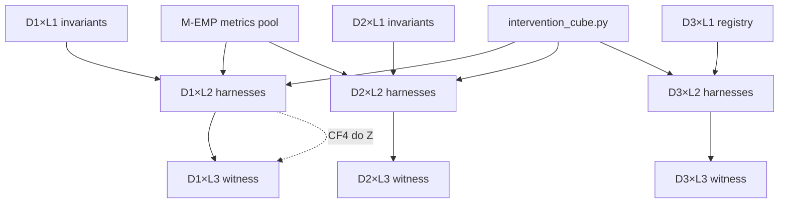

# Sci-Flow v3 — Cell-Filling Methodology

**Status:** `OPERATIONAL` methodology (2026-09-02)  
**Branch:** `research/cursor-starter-v0.2-woe-eis`  
**Claim ceiling:** **C2** — no AGI\*  
**Cube ontology:** [`SCI_FLOW_3D_CUBE.md`](SCI_FLOW_3D_CUBE.md)  
**Machine registry:** [`cell_registry.yaml`](cell_registry.yaml)  
**Proof ledger:** [`EIA_PROOF_PROTOCOL.md`](EIA_PROOF_PROTOCOL.md) / `evidence_proofs.py`

---

## Резюме (RU)

**Sci-flow v3** — операционная методология: **3D Evidence Cube** (D1/D2/D3 × L1/L2/L3) задаёт онтологию оценки; каждая из **9 ячеек** заполняется инкрементально на тиках sci-flow под потолком **C2**. Заполнение ячейки = инвариант (L1), runnable harness с `do(·)`-рукой (L2), witness-артефакт JSON/trace (L3) — **на своём слое**, не все три в одной ячейке. Текущий инвентарь: **8/9 ячеек filled**, **1 partial** (D3×L2); **L2-столбец (harness): 2 filled + 1 partial**. Топ-пробелы: D3×L2 (CF-7 governor isolation), D1×L3 (эмпирический proof-witness вместо stub), D1×L2 (continuous `E_C` + multi-seed EOI-k). Тики = приращения заполнения; express (`run_3d_express.py`) — smoke, не замена rubric.

---

## 1. Thesis — sci-flow v3 as cube cell-filling

**Definition.** Sci-flow v3 is an **operational research methodology** in which scientific progress is measured as **monotonic filling of a 3×3 evidence cube**, not as ad-hoc milestone completion.

Let:

- **Axes** \(D \in \{D1, D2, D3\}\): causal endogeneity (\(E_{\mathrm{endo}}\)), dynamic stability (\(\mathfrak{E}\), OMEGA, recurrence), boundary (\(N_H\), governor, falsifiers).
- **Layers** \(L \in \{L1, L2, L3\}\): invariants, dynamics (harnesses + interventions), witness (JSON/trace receipts).
- **Cell** \(C_{D,L}\): the unique slot at axis \(D\) and layer \(L\) (9 cells total).

A **sci-flow tick** is a bounded S1→S5 loop that **targets one or more cells** and produces verifiable artifacts under the active claim ceiling (`config.yaml` → `claim_ladder.active_ceiling: C2`).

**Cell-filling thesis:**

> Sci-flow v3 progress = \(\Delta\)fill\((C_{D,L})\) such that each cell moves `empty → partial → filled` via registered harnesses, without raising C-level or claiming AGI\*.

**Formal tick contract:**

1. **Pre-state:** cell status in `cell_registry.yaml` / cube doc.
2. **Action:** run harness with pre-registered `do(Z)`, `do(O)`, or `do(X)` from [`intervention_cube.py`](../cursor-starter-v0.2/src/eia/intervention_cube.py).
3. **Artifact:** dated JSON + markdown under `research/sci_flow/`.
4. **Post-state:** update registry, cube doc, optional `evidence_proofs` ledger entry.
5. **Ceiling:** `claim_allowed=false` unless pool explicitly allows `partial` at C2 (Tier A only); `agi_star_claim=false` always in v0.1 protocol.

**Not in scope:** production readiness, live side effects, C3 promotion, strong \(N_H\), \(\tau_{AGI}\).

---

## 2. Cell anatomy — filled / partial / empty

Each cell \(C_{D,L}\) holds **one layer's obligation** for axis \(D\). A cell is **not** required to contain L1+L2+L3 simultaneously; those are **different cells** in the same column.

| Status | L1 (Invariants) | L2 (Dynamics) | L3 (Witness) |
|--------|-----------------|---------------|--------------|
| **filled** | Causal/stability/boundary bar documented with falsifier taxonomy; cross-linked to pool | Runnable harness + ≥1 registered `do(·)` arm; reproducible command; dated artifact | JSON/trace receipt; express or dedicated runner passes; provenance path |
| **partial** | Doc exists but falsifier links incomplete | Smoke/scaffold only; explore-only; thresholds TBD; single-seed | Stub witness, classifier-only receipt, or soft Tier B proxy |
| **empty** | No axis bar doc | No harness | No artifact |

**Column coherence (dependency):** L2 harnesses should reference L1 falsifiers; L3 witnesses should cite L2 runner outputs. Filling L3 before L2 is allowed only for **structural stubs** (e.g. proof-protocol classifier) and remains `partial` until L2 empirical path exists.

---

## 3. Current 9×3 inventory

Last express smoke: [`M-3D-EXPRESS_2026-09-01.md`](M-3D-EXPRESS_2026-09-01.md) — 9/9 **smoke pass** in 1810 ms. Status below uses the **strict cell-filling rubric** (§7), not smoke pass alone.

| Cell | Status | Primary harness | Artifact | Tier | `claim_allowed` |
|------|--------|-----------------|----------|------|-----------------|
| **D1×L1** | filled | — (doc) | [`CAUSAL_ENDOGENEITY.md`](CAUSAL_ENDOGENEITY.md) | A | false |
| **D1×L2** | filled | [`run_cf4.py`](run_cf4.py), [`run_eoi_k.py`](run_eoi_k.py), [`eoi_k_harness.py`](eoi_k_harness.py) | [`M-CF4_metrics_2026-08-20.md`](M-CF4_metrics_2026-08-20.md), [`M-D01_EOI_k_metrics_2026-09-01.json`](M-D01_EOI_k_metrics_2026-09-01.json) | A | false |
| **D1×L3** | partial | [`run_eia_proof_protocol.py`](run_eia_proof_protocol.py), `evidence_proofs.py` | [`EIA_PROOF_PROTOCOL.md`](EIA_PROOF_PROTOCOL.md) | A | **partial** (protocol classifier only) |
| **D2×L1** | filled | — (doc) | [`STABLE_ENDOGENEITY.md`](STABLE_ENDOGENEITY.md) | B | false |
| **D2×L2** | filled | [`run_dsr_carryover.py`](run_dsr_carryover.py), [`run_shadow_att_r.py`](run_shadow_att_r.py), [`run_live_att_r.py`](run_live_att_r.py), [`run_mo_neuroplasticity_probe.py`](run_mo_neuroplasticity_probe.py), [`run_md.py`](run_md.py) | [`M-E04_DSR_metrics_2026-09-01.md`](M-E04_DSR_metrics_2026-09-01.md), [`M-MO_neuroplasticity_probe_2026-09-01.json`](M-MO_neuroplasticity_probe_2026-09-01.json) | B / C | false |
| **D2×L3** | filled | [`run_shadow_att_r.py`](run_shadow_att_r.py), [`run_live_att_r.py`](run_live_att_r.py) | [`M-R-LIVE_metrics_2026-08-21.md`](M-R-LIVE_metrics_2026-08-21.md), shadow `G'` events | B | false |
| **D3×L1** | filled | `intervention_cube.py` (13 interventions) | [`AGI_STAR_CRITERION.md`](AGI_STAR_CRITERION.md) | D | false |
| **D3×L2** | **partial** | [`run_non_embeddability.py`](run_non_embeddability.py), `ContactGovernor` | [`M-N_metrics_2026-08-21.md`](M-N_metrics_2026-08-21.md) | D explore | false |
| **D3×L3** | filled (soft) | [`run_boundary_witness.py`](run_boundary_witness.py), [`boundary_witness_harness.py`](boundary_witness_harness.py) | [`D3_BOUNDARY_WITNESS.md`](D3_BOUNDARY_WITNESS.md) | B soft \(N_H\) | false |

**Summary counts (strict rubric):** 8 filled · 1 partial · 0 empty.  
**L2-column (harness focus):** D1×L2 filled · D2×L2 filled · D3×L2 partial → **2/3 L2 cells fully filled**.

---

## 4. Fill order and dependencies

| Dependency | Blocks | Rationale |
|------------|--------|-----------|
| D×L1 before D×L2 | Same-axis dynamics | Harness must cite falsifiers from invariant doc |
| D×L2 before D×L3 (strict filled) | Same-axis witness | L3 receipts must reference L2 runner + metric ids |
| D1×L2 before D1×L3 empirical | Causal witness | Proof protocol accepts Tier A metrics produced by CF4/EOI runs |
| `intervention_cube.py` before D3×L2 CF-7 | Governor isolation | `do_z_governor_isolation` registered but no dedicated runner |
| M-CLI-P2 carryover before D2 longitudinal | DSR/ATT-R on main loop | Phase 2 shadow + optional daemon hydration |
| Express smoke | None (parallel) | Regression gate; does not upgrade partial→filled |

**Recommended fill priority (C2):** D1×L2 deepen → D1×L3 empirical → D3×L2 CF-7 → D2×L2 EOI drift → D3×L2 multi-seed ATT-N.

---

## 5. Tick taxonomy — past ticks → cells filled

| Tick / milestone | SCI_FLOW_LOG | Cells touched | Δfill |
|------------------|--------------|---------------|-------|
| M-CF4 | pre-3D | D1×L2, D1×L3 (CF4 metrics feed proof) | D1×L2 harness base |
| M-R / M-R-LIVE | Entry ≤027 | D2×L2, D2×L3 | recurrence harness + witness |
| M-E04/D05 DSR | Entry 028 | D2×L2, D2×L3 | 50-tick `B_D` longitudinal |
| EIA proof protocol v0.1 | Entry 028 | D1×L3 | classifier ledger (partial) |
| M-CLI-P2 carryover | Entry 029 | D2×L2 (enabler) | daemon hydration path |
| **M-3D-01** | Entry 030 | D1×L2, all L1 | cube scaffold + EOI-k |
| **D01 deepen** | Entry 031 | D1×L2 | counterfactual + `eoi_k_steered` |
| **M-3D-EXPRESS** | Entry 031 | all 9 (smoke) | express regression grid |
| **D3×L3 boundary** | Entry 032 | D3×L3 | soft \(N_H\) witness |
| **I01 arXiv** | Entries 033–035 | cross-doc | packages cube for publication; no new harness |
| **M-O Neuraxon/Graphitti** | Entry 036 | D2×L2 | Tier C `do(O)` plasticity probes |

**Tick naming convention:**

- `M-3D-*` — cube infrastructure (registry, express).
- `D01`, `E04`, etc. — Hermes / plan task ids mapped to cells.
- `M-O`, `M-N`, `M-CF4` — ATT/milestone harness families.

---

## 6. Gap analysis

| Gap cell | Current state | Proposed next harness | Notes |
|----------|---------------|----------------------|-------|
| **D3×L2** | partial | `run_cf7_governor_isolation.py` (stub) exercising `do_z_governor_isolation` + proposer/governor split | CF-7 registered in cube; no runner |
| **D1×L3** | partial | Wire `M-CF4` + D01 rows into `EvidenceItem` batch → `evaluate_eia_proof_version` artifact JSON | Stub accepts only when `do_z_changes_g_distribution=true` |
| **D1×L2** | filled (deepen) | `run_e_c_continuous.py` — continuous \(E_C\) under each `do_z_*` from cube | Pool `E_C` status=proxy |
| D2×L2 | filled (extend) | E04 part 2: EOI drift on 50-tick carryover session | Deferred in Entry 028 |
| D2×L2 M-O | Tier C | Neuraxon `O_t` → `OmegaWaveState` shadow multitick | Entry 036 next |
| D3×L2 ATT-N | explore | Multi-seed `run_non_embeddability.py` batch (n≥20) | Single-seed smoke only |
| D1×L2 EOI-k | filled | Multi-seed k-sweep + pre-registered JSON merge | Harden D01 against seed variance |
| Cross-cutting | — | Add `run_3d_express.py` to tier-0 optional gate | 9-cell regression <60s |

---

## 7. Acceptance criteria — filled vs partial (objective rubric)

A cell \(C_{D,L}\) is **`filled`** iff all mandatory checks pass:

| Layer | Mandatory checks |
|-------|------------------|
| **L1** | (1) Canonical doc exists under `research/sci_flow/`. (2) ≥2 falsifier ids named and linked to pool or `intervention_cube`. (3) Referenced in `SCI_FLOW_3D_CUBE.md`. |
| **L2** | (1) `python research/sci_flow/run_<harness>.py` exits 0. (2) ≥1 intervention from `intervention_cube.list_by_axis(D)` executed in harness. (3) Dated JSON artifact. (4) `claim_allowed` explicit in artifact. (5) pytest or tier-0 path covers harness logic. |
| **L3** | (1) Dated JSON/trace with provenance. (2) Metric ids map to pool tier. (3) For D1: `evaluate_eia_proof_version` run with **empirical** `EvidenceItem`(s) from L2 output **or** structural boundary receipt for D3. (4) `c_ladder_raise_allowed=false`, `agi_star_claim=false`. |

**`partial`** if any mandatory check fails but smoke/express returns `pass` or scaffold exists.

**`empty`** if no doc (L1), no runner (L2), or no artifact (L3).

**Express pass ≠ filled:** `run_3d_express.py` uses shortened smoke (6-tick DSR, n=2 ATT-N). Express `pass` means regression OK; rubric may still be `partial`.

---

## 8. Relation to proof protocol

[`evidence_proofs.py`](../cursor-starter-v0.2/src/eia/evidence_proofs.py) is the **D1×L3 ledger boundary**.

| Cube event | Proof protocol effect |
|------------|----------------------|
| L2 harness produces Tier A metric | Submit `EvidenceItem` with `metric_id ∈ {E_ENDO, CF4_E_PARTIAL, E_C, C_INT}` |
| Admissible item | `e_endo_support=partial`; `accepted_evidence_ids` appended |
| Rejected (OMEGA-only, declaration, F-EXT) | `rejected_evidence_ids`; falsifier ids recorded |
| Any v0.1 evaluation | `c_ladder_raise_allowed=false`, `agi_star_claim=false` |

**Cell-filling update workflow:**

1. L2 tick completes → write metrics JSON.
2. Map metrics → `EvidenceItem` (provenance = artifact path).
3. `evaluate_eia_proof_version(items)` → proof report markdown/JSON.
4. Update `cell_registry.yaml` `D1.L3.last_proof_report`.
5. SCI_FLOW_LOG Entry cites cells + proof version id.

D3×L3 boundary witness is **out of proof protocol v0.1 scope** (no \(N_H\) claim); it feeds falsifier registry only.

---

## 9. Roadmap — next 8 ticks (C2, no C3)

| # | Tick id | Target cell | Harness / deliverable |
|---|---------|-------------|----------------------|
| 1 | D01-BATCH | D1×L2 | Multi-seed EOI-k JSON merge |
| 2 | E-C-01 | D1×L2 | `run_e_c_continuous.py` under `do_z_*` |
| 3 | D1-L3-EMPIRICAL | D1×L3 | CF4 + D01 → proof ledger artifact |
| 4 | E04-EOI | D2×L2 | EOI drift on carryover session |
| 5 | CF7-01 | D3×L2 | Governor isolation harness |
| 6 | M-O-SHADOW | D2×L2 | Neuraxon→OmegaWaveState multitick |
| 7 | ATT-N-BATCH | D3×L2 | n≥20 non-embeddability batch |
| 8 | M-3D-EXPRESS-T0 | all 9 | Optional tier-0 express gate |

No tick above raises C-level; all `claim_allowed=false` except existing Tier A `partial` on accepted proof items.

---

## 10. Cross-links

| Document | Role |
|----------|------|
| [`SCI_FLOW_3D_CUBE.md`](SCI_FLOW_3D_CUBE.md) | Cube ontology + status grid |
| [`config.yaml`](config.yaml) | Milestone registry |
| [`ENDOGENEITY_METRICS_POOL.md`](ENDOGENEITY_METRICS_POOL.md) | Tier A–E metric ids |
| [`EIA_PROOF_PROTOCOL.md`](EIA_PROOF_PROTOCOL.md) | D1×L3 ledger rules |
| [`cell_registry.yaml`](cell_registry.yaml) | Machine-readable cell map |
| [`docs/SCI_FLOW_LOG.md`](../../docs/SCI_FLOW_LOG.md) | Tick history (Entries 028–036) |

---

## Document history

| Date | Change |
|------|--------|
| 2026-09-02 | Initial sci-flow v3 cell-filling methodology |
