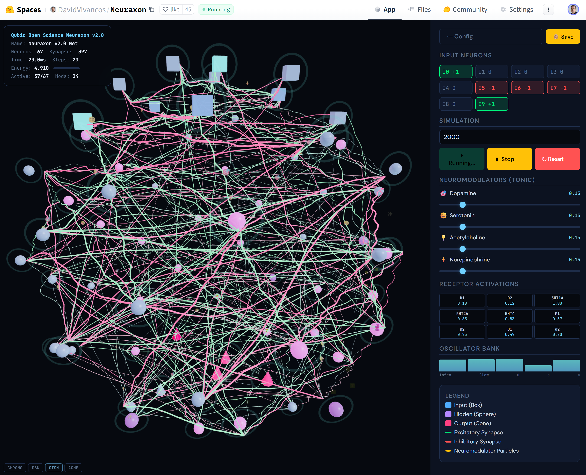
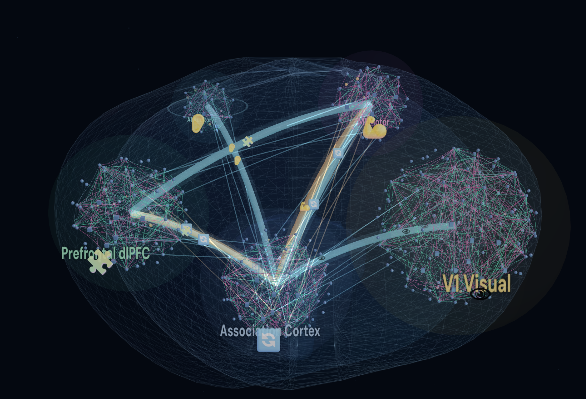
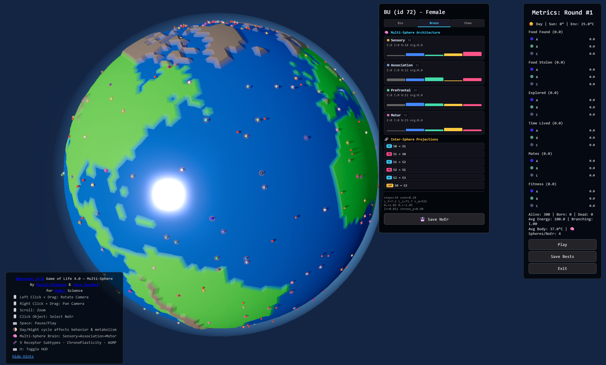

# 🪼 Multi Neuraxon V 2.0 Released + Cuda library 🚀

<div align="center">
<a href="https://www.python.org/"></a>
<a href="https://opensource.org/licenses/MIT"></a>
<a href="https://huggingface.co/spaces/DavidVivancos/Neuraxon">(Network Builder)</a>
<a href="https://huggingface.co/spaces/DavidVivancos/NeuraxonLife"> (Game Of Life Lite 3D)</a>
<a href="https://www.researchgate.net/publication/400868863_Neuraxon_V20_A_New_Neural_Growth_Computation_Blueprint"> (v2.0)</a>
<a href="https://github.com/DavidVivancos/Neuraxon/blob/main/neuraxon2.py"></a>
<a href="https://github.com/DavidVivancos/Neuraxon"></a>
<a href="https://huggingface.co/datasets/DavidVivancos/NeuraxonLife2-1M"></a>
<a href="https://huggingface.co/datasets/DavidVivancos/NeuraxonLife2.5-100K-TimeSeries"></a>
</div>
<br>

**A New Neural Growth & Computation Blueprint By Qubic Open Science David Vivancos & José Sanchez**  
*Continuous-time • Trinary-state • Multi-timescale • Neuromodulated • Structurally plastic*

**Full theoretical foundation:** [Neuraxon v2.0 Paper (ResearchGate)](https://www.researchgate.net/publication/400868863_Neuraxon_V20_A_New_Neural_Growth_Computation_Blueprint)

**Core implementation:** [`neuraxon2.py`](https://github.com/DavidVivancos/Neuraxon/blob/main/neuraxon2.py) (pure Python, no external dependencies, backward-compatible with v1).

**CuNxon Cuda Kernels & Library for Multi Neuraxon 2.0:** ([https://github.com/DavidVivancos/Neuraxon/cuNxon](https://github.com/DavidVivancos/Neuraxon/tree/main/cuNxon)) 

**Interactive 3D Network Builder Demo** : [Hugging Face Space](https://huggingface.co/spaces/DavidVivancos/Neuraxon)
<div align="center">
    
</div>

**Multi Neuraxon 2.0  Multi-Sphere 3D Network Builder Demo:** : (https://huggingface.co/spaces/DavidVivancos/MultiNeuraxon2)
<br> (Update March 31st 2026: Include brain preset for the abstraction of the fruit fly connectome: Drosophila melanogaster.)
<div align="center">
    
</div>

**Core implementation:** [`MultiNeuraxon2.py`](https://github.com/DavidVivancos/Neuraxon/blob/main/MultiNeuraxon2.py)

**Neuraxon Game of Life 5.1 v196 Research Version Mulit Nxon 2.0 (Based on Neuraxon 2.0)  + First g factor introduced + Evolutionary NAS:** (https://github.com/DavidVivancos/Neuraxon/tree/main/GameOfLife/5)

**Neuraxon Live -> Nxon GoL Server + Client V 1.058 v1078 Including NxonKaleido Brain viz :** ([https://github.com/DavidVivancos/Neuraxon/tree/main/GameOfLife/NxonLive](https://github.com/DavidVivancos/Neuraxon/tree/main/GameOfLife/NxonLive))

Play online at: https://nxon.online/


**Neuraxon Game of Life 5.0 Lite Demo (Based on Multi Neuraxon 2.0) + First Proto-Language/Audition :** [Neuraxon Game of Life Hugging Face Space](https://huggingface.co/spaces/DavidVivancos/NeuraxonLife)
<div align="center">
    
</div>

---
## Star History

[](https://www.star-history.com/#DavidVivancos/Neuraxon&type=date&legend=top-left)

<hr />


### What is Neuraxon 2.0?
Neuraxon is a **bio-inspired computational unit** that goes far beyond the classic perceptron. It uses **trinary logic** (`+1` excitatory, `0` neutral, `-1` inhibitory), operates in **continuous time** (inputs flow as constant streams), and performs computation at **both neuron and synapse levels**. Synapses have three dynamic weights (`w_fast`, `w_slow`, `w_meta`) and can form, collapse, or reconnect; hidden neurons can even die. Spontaneous activity, autoreceptors, homeostatic plasticity, and four neuromodulators (DA, 5-HT, ACh, NA) with nine receptor subtypes make the network intrinsically alive and adaptive.

**v2.0** introduces a **unified 4-step pipeline** executed every simulation step:  
1. **Time Warping (ChronoPlasticity)** – adaptive memory horizon per synapse  
2. **Dynamic Decay (DSN)** – input-conditioned decay via causal convolution  
3. **CTSN Complemented State** – learnable complement term prevents information loss  
4. **AGMP (Astrocyte-Gated Multi-timescale Plasticity)** – eligibility × modulator × astrocyte gate  

Additional breakthroughs:  
- **MSTH** (Multi-Scale Temporal Homeostasis) – 4 coordinated regulatory loops (ultrafast → slow)  
- **Nonlinear dendritic branch integration** with supralinear gamma  
- **Watts-Strogatz small-world topology** (ring + rewiring)  
- **Full receptor subtype system** (tonic/phasic, nonlinear activation)  
- **Oscillator bank** with cross-frequency coupling (PAC)  
- **Aigarth Intelligent Tissue hybridization** for evolutionary mutation/selection  


### Why Neuraxon 2.0 Matters – Revolutionary for AI
Traditional ANNs and even most SNNs suffer from discrete time steps, binary/spiking simplification, static topologies, catastrophic forgetting, and catastrophic rigidity. Neuraxon 2.0 solves these at the architectural level:

- **Continuous real-time learning** – no separate training/inference phases; adapts instantly to streaming data.  
- **Temporal richness** – timing, duration, frequency, and sequence of trinary states encode information.  
- **Biological plausibility** – dendrites, silent synapses, neuromodulation, homeostasis, astrocyte-like gating, spontaneous activity.  
- **Energy efficiency & robustness** – sparse trinary activity + multi-timescale decay + homeostasis prevent saturation/plasticity loss.  
- **Evolvability** – Aigarth hybrid enables population-level evolution of network structure and parameters.  

**Applications that become possible:**
- Embodied / robotic control with proprioception and continuous sensory streams  
- Real-time temporal pattern recognition (finance, neuroscience, robotics)  
- Cognitive modeling of consciousness, attention, sleep/wake cycles  
- Continual lifelong learning without forgetting  
- Energy-efficient edge AI and neuromorphic hardware targets  
- Artificial life and open-ended evolution  
- Pathways toward AGI that respects biological constraints  

v2.0 is not an incremental update — it is a **new blueprint** for neural growth and computation.

---

### 🚀 Quick Start (neuraxon2.py)

```bash
from neuraxon2 import (
    NetworkParameters,
    NeuraxonNetwork,
    NeuraxonApplication,
    NeuraxonAigarthHybrid
)

# 1. Create network with biologically-plausible defaults
params = NetworkParameters(
    num_input_neurons=5,
    num_hidden_neurons=30,
    num_output_neurons=5,
    # v2.0 new parameters
    dsn_enabled=True,
    ctsn_enabled=True,
    agmp_enabled=True,
    chrono_enabled=True,
    msth_ultrafast_tau=5.0,
    ws_k=8,
    ws_beta=0.35
)

network = NeuraxonNetwork(params)

# 2. Set continuous inputs (trinary)
network.set_input_states([1, -1, 0, 1, -1])

# 3. Simulate (continuous time)
for step in range(200):
    network.simulate_step()
    if step % 50 == 0:
        outs = network.get_output_states()
        print(f"Step {step:3d} | Outputs: {outs} | Energy: {network.get_energy():.3f}")

# 4. Live neuromodulation
network.modulate('dopamine', 0.85)      # boost learning
network.modulate('serotonin', 0.6)      # modulate plasticity

# 5. Application layer – pattern storage & recall
app = NeuraxonApplication(params)
app.store_pattern("A", [1,1,-1,-1,1], steps=50)
recall = app.recall_pattern("A", steps=30, mask_fraction=0.4)
print("Recall:", recall)

# 6. Evolutionary Aigarth hybrid
hybrid = NeuraxonAigarthHybrid(params)
dataset = [([1,0,0,0,0],[1,0,0,0,0]), ...]  # your task
hybrid.evolve(dataset, seasons=5, episodes=20)
print("Best fitness:", hybrid.best().fitness)

# 7. Save / load (full state, backward-compatible with v1)
from neuraxon2 import save_network, load_network
save_network(network, "my_net_v2.json")
loaded = load_network("my_net_v2.json")
```


## 📚 Citation

If you use Neuraxon v 2.0  in your research, please cite:
```bibtex
@article{Vivancos-Sanchez-2026neuraxon2,
    title={Neuraxon v2.0: A New Neural Growth \& Computation Blueprint},
    author={David Vivancos and Jose Sanchez},
    year={2026},
    journal={ResearchGate Preprint},
    institution={Artificiology Research, UNIR University, Qubic Science},
    url={https://www.researchgate.net/publication/400868863_Neuraxon_V20_A_New_Neural_Growth_Computation_Blueprint}
}
```
If you use Neuraxon 1.0 in your research, please cite:
```bibtex
@article{Vivancos-Sanchez-2025neuraxon,
    title={Neuraxon: A New Neural Growth \& Computation Blueprint},
    author={David Vivancos and Jose Sanchez},
    year={2025},
    journal={ResearchGate Preprint},
    institution={Artificiology Research, UNIR University, Qubic Science},
    url={https://www.researchgate.net/publication/397331336_Neuraxon}
}
```
If you use the Neuraxon2LifeTS dataset, please also cite:
```bibtex
@dataset{Neuraxon2LifeTS,
  title={Neuraxon 2.0 Time Series Dataset},
  author={Vivancos, David and Sanchez, Jose},
  year={2026},
  publisher={Hugging Face},
  url={https://huggingface.co/datasets/DavidVivancos/Neuraxon2LifeTS}
}
```

If you use the NeuraxonLife2-1M dataset, please also cite:
```bibtex
@dataset{NeuraxonLife2-1M,
  title={Neuraxon: Artificial Life 2.0 BioInspired Neural Network Simulation 1M Dataset},
  author={Vivancos, David and Sanchez, Jose},
  year={2025},
  publisher={Hugging Face},
  url={https://huggingface.co/datasets/DavidVivancos/NeuraxonLife2-1M}
}
```

If you use the NeuraxonLife2.5-100K-TimeSeries dataset, please also cite:
```bibtex
@dataset{NeuraxonLife2.5-100K-TimeSeries,
  title={Neuraxon: Artificial Life 2.5 BioInspired Neural Network Simulation 100K-TimeSeries Dataset},
  author={Vivancos, David and Sanchez, Jose},
  year={2025},
  publisher={Hugging Face},
  url={https://huggingface.co/datasets/DavidVivancos/NeuraxonLife2.5-100K-TimeSeries}
}
```


## 🤝 Contributing

We welcome contributions! Areas of interest include:

- Novel plasticity mechanisms
- Additional neuromodulator systems
- Energy efficiency optimizations
- New application domains
- Visualization tools
- Performance benchmarks
- Game of Life extensions and scenarios

Please open an issue to discuss major changes before submitting PRs.

## 📧 Contact

**David Vivancos**  
Artificiology Research https://artificiology.com/ , Qubic https://qubic.org/ Science Advisor
Email: vivancos@vivancos.com

**Jose Sanchez**  
UNIR University, Qubic https://qubic.org/ Science Advisor  
Email: jose.sanchezgarcia@unir.net

## 📄 License

MIT License. See `LICENSE` file for details.

## ⚠️ Important License Notice

**Core Neuraxon**: Licensed under MIT License (permissive, no restrictions)

**Aigarth Hybrid Features**: If you implement the Aigarth hybrid features described in our paper, you **MUST** comply with the [Aigarth License](THIRD_PARTY_LICENSES.md), which includes:

- ❌ **NO military use** of any kind
- ❌ **NO use by military-affiliated entities**
- ❌ **NO dual-use applications** with military potential

The standalone Neuraxon implementation (without Aigarth integration) has no such restrictions.

## 🙏 Acknowledgments

This work builds upon decades of neuroscience research on:
- Synaptic plasticity (Bi & Poo, 1998)
- Neuromodulation (Brzosko et al., 2019)
- Spontaneous neural activity (Northoff, 2018)
- Continuous-time neural computation (Gerstner et al., 2014)

Special thanks to the Qubic's Aigarth team for the evolutionary tissue framework integration.

---

<div align="center">
<i>Building brain-inspired AI, one Neuraxon at a time</i> 🧠✨
</div>


